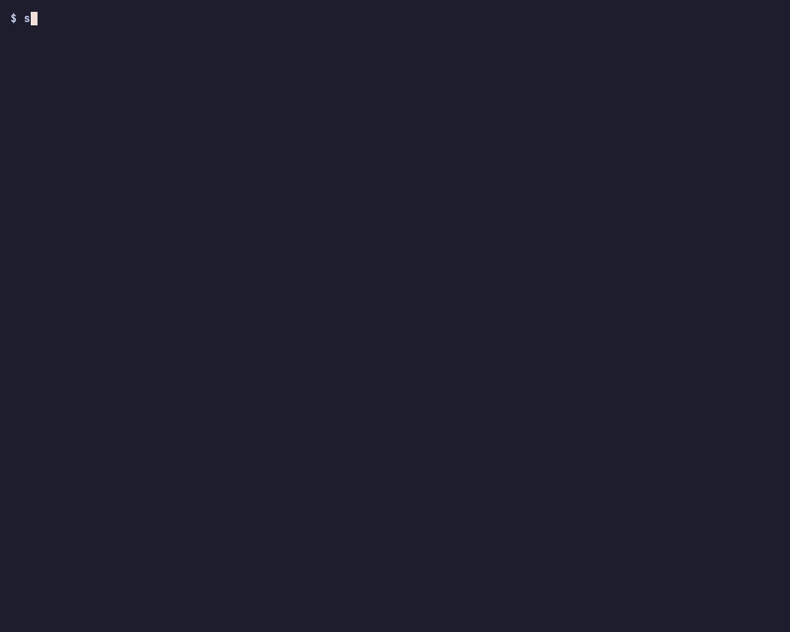
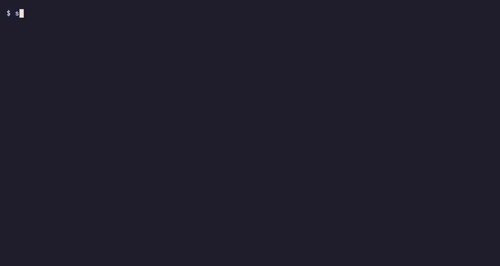

# 하루치 일 6개를 에이전트에게 맡기고, 상태로 확인하기

> 보관된 글입니다. 2026-08-23의 여섯 에이전트 운영 기록을 보존하지만,
> 현재 튜토리얼 학습 경로에는 포함하지 않습니다.

한 프로젝트의 일 여섯 개를 에이전트 여섯에게 맡깁니다. 시작 전에 필요한 결과를 한 줄로 적고, 실행 전에 조사 보고를 읽습니다. 하루가 끝나면 `self work`에서 각 일이 어디까지 갔는지 확인합니다.

아래 명령과 출력은 2026-08-23의 실제 기록입니다. 운영자 화면만 격리된 임시 워크스페이스에서 같은 명령으로 다시 녹화했습니다. 에이전트는 Orca 워크트리마다 Claude Code 세션을 하나씩 사용했습니다.

## 도착점

먼저 그날 저녁의 화면을 봅니다. 여섯 작업 단위가 모두 `active`이고, 각 단위에는 보고와 증거가 붙어 있습니다.

```text
$ self work --project superself --plain | grep -E "w-(rwmxx|fd2dg|6h4es|qda0a|64t76|fvhq9)"
w-fd2dg  active  self entries are merged into at least 3 existing agent-rules/AGENTS.md front-door lists, …
w-rwmxx  active  dsh-plugin-superself is public: installable with dsh plugin add from npm …
w-6h4es  active  superselfs.com has a use-with guide generator: src/content/harnesses.ts drives /use-with/<harness> pages …
w-qda0a  active  English discovery channels are examined before any posting: a recorded table per channel …
w-64t76  active  superselfs.com has a /talk screening page in Korean and English: five screening questions …
w-fvhq9  active  The adoption-metrics snapshot runs again daily and reads truthfully: the launchd job that stopped …

$ self work show w-rwmxx
held by another session, running since 2026-08-22 15:25
# w-rwmxx — dsh-plugin-superself is public: …
- Status: active
- Evidence: 8ad441b (provisional), 624a82c (provisional), c4956ee (settled)
- Evidence notes: https://github.com/fxylabs/superself/pull/321; …; https://github.com/awesome-dsh-plugin/awesome-dsh-plugin/pull/2761
## Reports (latest first)
- 2026-08-22 — npm publish done by the maintainer: dsh-plugin-superself@0.1.0 is live …
```

2분 인트로: [`intro.mp4`](../../../examples/2026-08-23-delegation-day/tapes/intro.mp4) ([GIF](../../../examples/2026-08-23-delegation-day/tapes/intro.gif)).

## 준비물

- `self` 0.7.0 (`npm install -g superself`), 그리고 `self init`과 `self project init`을 마친 프로젝트. 처음이면 [시작 가이드](../../guides/getting-started.md)를 먼저 따라 하세요.
- 에이전트 하네스 하나. 이 날은 Orca 워크트리마다 Claude Code 세션을 하나씩 띄웠습니다. `self`는 어느 하네스에서나 같은 명령을 씁니다.
- 기록된 실행 시간은 1시간 45분입니다. 첫 브리프는 2026-08-22 14:57(UTC)에 썼고, 여섯 번째 단위는 16:42에 시작했습니다.

## 1단계. 방향을 먼저 기록하기

**명령.** 전략 논의에서 결정 다섯 개를 기록했습니다. 제안 상태의 결정은 `Waiting on you`에 나타납니다.

```text
$ self decide "M1 front-door strategy: Superself does not open its own curated repo now; …" --why "…" --proposed
$ self context
## Waiting on you
- proposal [no work recorded as gated]: M1 front-door strategy: … (confirm with `self decide confirm 01m0n7…`)
$ self decide confirm 01m0n7…
✓ entity.confirmed  M1 front-door strategy: Superself does not open its own curated repo now; it ge…
```



**기록.** DSH wave 결정에는 "Superself ships a plugin, not a repo … within 7 days"라고 적혀 있습니다. `why`에는 출시 당일 목록 자리는 닫혔지만 플러그인 표면은 열려 있었다는 판단이 남아 있습니다.

**상태.** 확인이 끝나면 `Waiting on you`가 비고, 결정은 다음 세션의 `self context`에 나타납니다. `self status`에서 `waiting on you`가 0인지 확인합니다.

## 2단계. 브리프를 작업 단위로 쓰기

**명령.** 일마다 `self work add "<필요한 결과>"`를 한 번 실행합니다. 그날 기록한 여섯 줄 가운데 둘입니다.

```text
$ self work add "dsh-plugin-superself is public: installable with dsh plugin add from npm (dsh-plugin keyword, dsh.bundle manifest), exposes self context/work/report/decide as tools plus a slash command, its entry is merged in awesome-dsh-plugin under workflow, and it is announced in the DSH Discord — by 2026-08-30"
w-rwmxx
$ self work add "The adoption-metrics snapshot runs again daily and reads truthfully: the launchd job that stopped after 2026-08-17 is diagnosed and fixed with the cause recorded, …"
w-fvhq9
```



**상태.** `self work`에 여섯 줄이 `next`로 나타납니다. 한 줄만 읽고도 끝난 모습을 그릴 수 있어야 합니다. 그렇지 않다면 필요한 결과를 다시 씁니다.

## 3단계. 실행 전에 계획을 읽기

**기록.** w-fd2dg를 맡은 에이전트는 PR을 열기 전에 후보 목록 여섯 곳을 조사했습니다. 첫 보고의 일부입니다.

```text
w-fd2dg step 1 — survey of six front-door lists (data pulled 2026-08-23 via `gh api`; no PR opened yet)
| repo | contribution rules | entry form | … | verdict |
| steipete/agent-rules | none; repo ARCHIVED 2026-05 | … | skip — read-only |
| github/awesome-copilot | … `npm run skill:validate`; PR to `main` … | skill folder | … | submit as skill |
| hesreallyhim/awesome-claude-code | "… must be created by human beings" | issue form | … | the maintainer must file the web form by hand |
```

**명령.** 운영자는 표를 읽고 진행을 승인했습니다. w-rwmxx 보고에는 그 순간이 "User said proceed. The only blocker was CI verify on #321 …"로 남아 있습니다.

**상태.** 후보 목록 여섯 곳 중 두 곳은 보관됐거나 주제와 맞지 않아 제외했습니다. 사람만 제출할 수 있는 폼 하나는 운영자에게 넘겼습니다. `self work show w-fd2dg`에서 "no PR opened yet"가 "step 3 complete: submissions opened"보다 먼저 기록됐는지 확인합니다.

## 4단계. 위임하기

**명령.** 각 워크트리의 세션이 `self work start <id>`를 실행했습니다. 그 뒤에는 다른 세션도 누가 그 단위를 맡았는지 볼 수 있습니다.

```text
$ self work show w-6h4es
held by another session, running since 2026-08-22 16:05
```

Orca 터미널에서 읽은 한 줄(w-6h4es, 원문): "PR #1이 열렸습니다. 마무리로 최종 self report·Orca 카드 갱신·로컬 서버 정리·임시 worktree 삭제를 한 번에 처리합니다."

**상태.** 여섯 줄이 `next`에서 `active`로 바뀝니다. 당시 기록을 모은 시점에는 `self work show <id> --history`의 마지막 줄이 `entity.started`였습니다.

## 5단계. 증거가 붙은 보고를 받기

**명령.** 에이전트는 체크포인트마다 `self report <id> "<검증 가능한 결과>" --evidence <commit>`을 실행했습니다. w-rwmxx 보고의 일부입니다.

```text
- 2026-08-22 — PR #321 open: https://github.com/fxylabs/superself/pull/321 … All four root gates green locally: pnpm typecheck, pnpm build, pnpm test (cli 976 tests/0 fail + plugin 23/0), pnpm structure. … Unit is NOT done until publish + list merge. Friction: root test tier took ~25 min on this Mac, not the ~12 min CONTRIBUTING states; dsh plugin add needs --profile (no default) … [8ad441b]
```

구현 보고에는 예상과 달랐던 점도 남겼습니다. w-fvhq9에는 "Friction: expected a dead launchd job or a dirty tree; it was a swallowed non-fast-forward push that launchd reported as exit 0"라고 적혀 있습니다.


**상태.** `self work show`의 `Evidence:` 줄에 커밋과 판정이 나타납니다. 보고 끝의 `[8ad441b]`와 `Evidence:` 줄의 해시가 같은지 확인합니다.

## 6단계. 멈춤과 이탈을 기록으로 잡기

**명령.** 증거가 없는 단위를 닫아 보고, 이어서 상태를 읽었습니다.

```text
$ self work done w-n21cx
error: w-n21cx has no evidence for done — attach a report first (`self report w-n21cx "<summary>" --evidence <commit>` or `--artifact <path>`), or state what verifiably happened with `self work done w-n21cx --report "<what happened>"`

$ self status --project superself
health: w-1aedt looks stalled — no events for 12 days; … w-64t76 evidence aa22c28 was reset away on its branch — that direction reads as attempted and abandoned; …
```

에이전트 쪽도 같은 규칙을 따릅니다. w-6h4es: "Not marked done — maintainer closes on merge." w-rwmxx: "Unit is NOT done until publish + list merge."

**상태.** 증거 없는 완료는 거부됩니다. 중간에 멈춘 단위는 `looks stalled`, 브랜치에서 사라진 커밋은 `abandoned`로 표시됩니다. `self status`의 `health:` 줄에서 둘을 확인합니다.

## 7단계. 다음 세션이 이어받게 하기

**명령.** 다음 날 새 세션에서 `self context`를 실행했습니다. 여섯 단위가 마지막 보고와 함께 `Work in progress`에 남아 있습니다.

```text
## Work in progress
- w-rwmxx dsh-plugin-superself is public: … [held by another session, running since 2026-08-22 15:25] — latest report: npm publish done by the maintainer: dsh-plugin-superself@0.1.0 is live … Remaining: the list maintainers merge #2761; …
- w-6h4es superselfs.com has a use-with guide generator: … — latest report: PR opened: … Gates: build green …
```


**상태.** 새 세션은 별도 인계 문서 없이 마지막 보고를 읽을 수 있습니다. 각 줄에 `latest report:`가 붙어 있는지 확인합니다.

## 상태 diff

| | 아침(브리프 전) | 저녁(마지막 보고 후) |
| --- | --- | --- |
| 결정 | 제안 상태 | 결정 4건 확인(M1 front door, DSH wave, M4, M5), 컨벤션 1건(content loop v2) |
| 작업 단위 | 없음 | 6개, 모두 `active`, `held by another session` |
| 보고 | 0 | w-rwmxx 9, w-fd2dg 5, w-6h4es 2, w-qda0a 1, w-64t76 2, w-fvhq9 2 |
| 증거 | 없음 | 커밋 8개, 판정 포함(`settled` 1, `abandoned` 1) |
| 밖에 남은 것 | | PR #321 머지, #323 머지, #326 열림, superself-apps PR 2건 열림, awesome 리스트 PR 4건 열림, 채널 표 artifact 1건 |

## 다음 단계

- 다음 튜토리얼: 밀린 결정을 에이전트가 제안하고 운영자가 한 번에 정리하기 (준비 중).
- 개념: [Company State와 context](../../concepts/company-state-and-context.md).

## 출처

- [2026-08-23 원자료와 녹화 정보](../../../examples/2026-08-23-delegation-day/README.md)
- [에이전트가 방향에서 벗어나거나 중간에 멈춘 사례 11건](../../../examples/2026-08-23-delegation-day/voices.md)
- 각 작업 단위의 브리프·보고·이력: [`examples/2026-08-23-delegation-day/units/`](../../../examples/2026-08-23-delegation-day/README.md)
