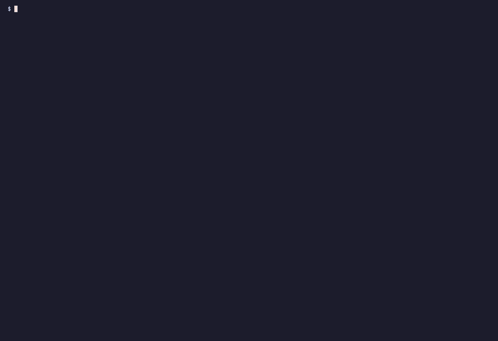

# 에이전트의 작업 계획을 리뷰하고 결과까지 받기

작업 하나를 에이전트에게 맡깁니다. 계획을 먼저 `work`에 올리고, 실행 전에 리뷰하고, 결과는 커밋과 테스트가 붙은 보고로 확인합니다.

## 도착점

끝나면 `self work show`에서 완료 상태, 증거 커밋, 보고를 한 화면에서 볼 수 있습니다.

```text
- Status: done
- Branches: main
- Evidence: fea913a2c806 (settled)

## Reports (latest first)

- 2026-08-24 — Implemented the accepted v2 plan in commit fea913a. The zero-dependency checker scans README.md and docs/**/*.md, validates relative Markdown file targets, strips cross-file fragments before file lookup, skips external URLs and same-page anchors, and is exposed as npm run check:links. Four node:test cases cover valid links, missing files, nested docs, and cross-file fragments. Verification passed: npm test (4/4) and npm run check:links (3 Markdown files, all local file links resolve). [fea913a2c806]
```

전체 기록은 [2분 6초 영상](../../examples/2026-08-24-one-work-review/tapes/intro.mp4)과 [GIF](../../examples/2026-08-24-one-work-review/tapes/intro.gif)에서 볼 수 있습니다.



## 준비물

- `self work revise`를 지원하는 `self`. 이 기록은 Superself `5e3cdb7`에서 실행했습니다.
- `self project init`을 마친 Git 저장소. 처음이면 [시작 가이드](../guides/getting-started.md)를 먼저 따라 하세요.
- 에이전트 세션 하나와 10분 정도의 작은 작업. 기록에 쓴 작업은 로컬 Markdown 링크 검사기였습니다.

## 1단계. 계획을 work에 올리기

에이전트에게 저장소를 살펴보고 실행 계획을 쓰게 합니다. 에이전트는 구현을 시작하지 않고 계획 전체를 `work propose`에 넣었습니다.

```text
$ self work propose "Add a zero-dependency local Markdown link checker to this repository. Plan: inspect README.md and docs/*.md; add scripts/check-links.mjs to recursively check relative Markdown file targets under README.md and docs/, while ignoring external URLs and same-page anchors; add node:test cases for valid links and missing files; expose npm run check:links and document it; run npm test and npm run check:links; commit the implementation and attach the verification as a self report. Do not access the network or change files outside the checker, its tests, package.json, and README.md."
entity.proposed recorded [01m0rp0hack79eg1172kpk7ryr]
w-cs7dj
```

`self work show w-cs7dj`에서 `Status: review`, `Plan: v1`, `not yet accepted`를 확인하세요.

## 2단계. 시작 전에 계획 리뷰하기

승인하지 않은 계획은 시작할 수 없습니다. 승인 전에 `work start`를 실행하자 CLI가 리뷰 상태와 승인 명령을 알려 줬습니다.

```text
$ self work start w-cs7dj
error: w-cs7dj is waiting on review — its plan (v1) has not been accepted; a person runs `self work accept w-cs7dj`
```

리뷰 에이전트는 기존 `README.md`의 fragment 링크 처리와 `docs/*.md`의 재귀 범위가 빠졌다고 지적했습니다. 두 항목은 구현 전에 고쳐야 했습니다.

## 3단계. 같은 ID에서 계획 고치기

에이전트에게 두 지적을 반영하게 합니다. `work revise`는 새 work를 만들지 않고 `w-cs7dj`에 v2를 기록했습니다.

```text
$ self work revise w-cs7dj "Add a zero-dependency local Markdown link checker to this repository. Plan: inspect README.md and every Markdown file recursively under docs/**/*.md; add scripts/check-links.mjs to check that relative Markdown file targets exist; for a link to another Markdown file with a #fragment, strip the fragment before resolving the file and do not validate the anchor itself; ignore external URLs and same-page anchors; add node:test cases for valid links, missing files, a nested docs directory, and a cross-file fragment; expose npm run check:links and document its supported scope; run npm test and npm run check:links; commit the implementation and attach the verification as a self report. Do not access the network or change files outside the checker, its tests, package.json, and README.md." --why "Review found that v1 did not define cross-file fragment handling and conflicted between docs/*.md and recursive discovery. v2 strips fragments before file lookup, keeps anchor validation out of scope, fixes the supported input to docs/**/*.md, and adds both cases to the test plan."
entity.revised recorded [01m0rpawj2bn6y3qj9jp6etdq7]
w-cs7dj — v2; a person runs `self work accept w-cs7dj`
```

`self work show w-cs7dj --history`에는 v1과 v2가 시간순으로 남습니다. 두 번째 리뷰는 실행을 막을 결함이 더 없다고 판정했습니다.

## 4단계. 리뷰가 끝난 revision 승인하기

운영자가 v2를 승인한 뒤 에이전트가 작업을 시작합니다. 순서를 바꾸지 마세요.

```text
$ self work accept w-cs7dj
entity.confirmed recorded [01m0rpc9hx9n9rx90wfpf7m73v]
w-cs7dj

$ self work start w-cs7dj
entity.started recorded [01m0rpcj3hv9r3fws2s8k59tzz]
```

이 시점부터 계획은 고정됩니다. 이후 계획을 바꿔야 한다면 successor work를 만들어야 합니다.

## 5단계. 보고와 증거 확인하기

에이전트는 구현을 커밋하고 계획에 적힌 두 검증 명령을 실행했습니다. 테스트 4개가 통과했고 문서 3개의 로컬 링크가 모두 해석됐습니다.

```text
$ npm test
ℹ tests 4
ℹ pass 4
ℹ fail 0

$ npm run check:links
Checked 3 Markdown files: all local file links resolve.

$ self report w-cs7dj "Implemented the accepted v2 plan in commit fea913a. The zero-dependency checker scans README.md and docs/**/*.md, validates relative Markdown file targets, strips cross-file fragments before file lookup, skips external URLs and same-page anchors, and is exposed as npm run check:links. Four node:test cases cover valid links, missing files, nested docs, and cross-file fragments. Verification passed: npm test (4/4) and npm run check:links (3 Markdown files, all local file links resolve)."
report.added recorded [01m0rpefcafjjs792tdg8wfjse]
```

`self work show w-cs7dj`에서 `Evidence: fea913a2c806 (settled)`과 같은 커밋을 가리키는 보고가 함께 있는지 확인하세요.

## 6단계. 결과를 읽고 완료 판단하기

운영자는 보고와 테스트 결과를 읽은 뒤 결과가 v2 계획을 충족한다고 판단했습니다. 그 뒤에만 work를 닫았습니다.

```text
$ self work done w-cs7dj
entity.done recorded [01m0rpj4nf9yf9q4w2f1a4da3g]
```

마지막 `self work show w-cs7dj`에서 `Status: done`과 settled evidence를 확인하세요.

## 상태 변화

| 시점 | 상태 | 확인할 것 |
| --- | --- | --- |
| v1 제안 뒤 | `review` | 아직 승인되지 않은 v1 |
| v2 수정 뒤 | `review` | 같은 ID, 승인되지 않은 v2 |
| v2 승인 뒤 | `next` | 현재 revision이 승인됨 |
| 시작 뒤 | `entity.started` | 승인된 계획이 처음 시작됨 |
| 완료 판단 뒤 | `done` | settled evidence와 최종 보고가 남음 |

## 다음 단계

work 하나의 수명 주기를 익혔다면 [장기 프로젝트 운영하기](../guides/running-a-long-term-project.md)에서 여러 세션에 보고를 이어 가는 방법을 확인하세요. 상태가 기록에서 어떻게 계산되는지는 [회사 상태와 컨텍스트](../concepts/company-state-and-context.md)에 설명돼 있습니다.

## 출처

- [실행 기록과 fact table](../../examples/2026-08-24-one-work-review/README.md)
- Superself `5e3cdb7`, `work propose`, `work revise`, `work accept`, `work start`, `report`, `work done` 실제 실행
