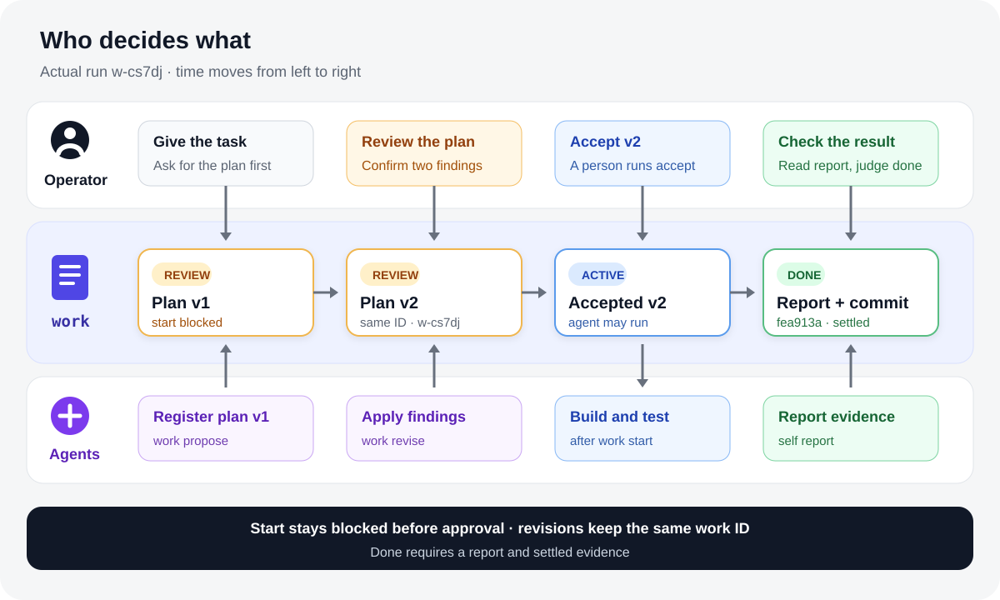

# Review an agent's work plan and read the result

Give one bounded job to one agent. Put the plan in `work`, review it before execution, and judge the result from a report tied to a tested commit.

One work ID, `w-cs7dj`, moves through four states. The operator approves the plan and makes the final done decision; agents draft and revise the plan, execute the accepted revision, and report the result.



## Destination

At the end, `self work show` puts the final status, settled commit, and report in one view.

```text
- Status: done
- Branches: main
- Evidence: fea913a2c806 (settled)

## Reports (latest first)

- 2026-08-24 — Implemented the accepted v2 plan in commit fea913a. The zero-dependency checker scans README.md and docs/**/*.md, validates relative Markdown file targets, strips cross-file fragments before file lookup, skips external URLs and same-page anchors, and is exposed as npm run check:links. Four node:test cases cover valid links, missing files, nested docs, and cross-file fragments. Verification passed: npm test (4/4) and npm run check:links (3 Markdown files, all local file links resolve). [fea913a2c806]
```

Check the commands in the diagram against the [22-second terminal replay](../../examples/2026-08-24-one-work-review/tapes/intro.gif). The [41-second video](../../examples/2026-08-24-one-work-review/tapes/intro.mp4) also includes the full plan and test run.

## Before you start

- A `self` build that supports `self work revise`. This run used Superself commit `5e3cdb7`.
- A Git repository registered with `self project init`. Follow [Getting Started](../guides/getting-started.md) first if needed.
- One agent session and a task that takes about 10 minutes. The recorded task added a local Markdown link checker.

## Step 1. Put the plan in work

Ask the agent to inspect the repository and write the execution plan. The agent records the whole plan with `work propose` and does not begin implementation.

```text
$ self work propose "Add a zero-dependency local Markdown link checker to this repository. Plan: inspect README.md and docs/*.md; add scripts/check-links.mjs to recursively check relative Markdown file targets under README.md and docs/, while ignoring external URLs and same-page anchors; add node:test cases for valid links and missing files; expose npm run check:links and document it; run npm test and npm run check:links; commit the implementation and attach the verification as a self report. Do not access the network or change files outside the checker, its tests, package.json, and README.md."
entity.proposed recorded [01m0rp0hack79eg1172kpk7ryr]
w-cs7dj
```

Run `self work show w-cs7dj` and check for `Status: review`, `Plan: v1`, and `not yet accepted`.

## Step 2. Review before execution

An unaccepted plan cannot start. Before approval, `work start` stopped here:

```text
$ self work start w-cs7dj
error: w-cs7dj is waiting on review — its plan (v1) has not been accepted; a person runs `self work accept w-cs7dj`
```

The review agent found two defects: v1 omitted handling for the fragment link already in `README.md`, and its `docs/*.md` input conflicted with recursive discovery. Both had to change before implementation.

## Step 3. Revise under the same ID

Have the agent apply the findings. `work revise` recorded v2 under `w-cs7dj` instead of creating another work unit.

```text
$ self work revise w-cs7dj "Add a zero-dependency local Markdown link checker to this repository. Plan: inspect README.md and every Markdown file recursively under docs/**/*.md; add scripts/check-links.mjs to check that relative Markdown file targets exist; for a link to another Markdown file with a #fragment, strip the fragment before resolving the file and do not validate the anchor itself; ignore external URLs and same-page anchors; add node:test cases for valid links, missing files, a nested docs directory, and a cross-file fragment; expose npm run check:links and document its supported scope; run npm test and npm run check:links; commit the implementation and attach the verification as a self report. Do not access the network or change files outside the checker, its tests, package.json, and README.md." --why "Review found that v1 did not define cross-file fragment handling and conflicted between docs/*.md and recursive discovery. v2 strips fragments before file lookup, keeps anchor validation out of scope, fixes the supported input to docs/**/*.md, and adds both cases to the test plan."
entity.revised recorded [01m0rpawj2bn6y3qj9jp6etdq7]
w-cs7dj — v2; a person runs `self work accept w-cs7dj`
```

Run `self work show w-cs7dj --history` to see v1 followed by v2. The second review found no remaining material defect.

## Step 4. Accept the reviewed revision

The operator accepts v2, then the agent starts the work. Keep those actions in that order.

```text
$ self work accept w-cs7dj
entity.confirmed recorded [01m0rpc9hx9n9rx90wfpf7m73v]
w-cs7dj

$ self work start w-cs7dj
entity.started recorded [01m0rpcj3hv9r3fws2s8k59tzz]
```

The first start freezes the plan. A later material correction needs a successor work unit.

## Step 5. Read the report and evidence

The agent committed the implementation and ran the two checks named in v2. Four tests passed, and the checker resolved local links in three Markdown files.

```text
$ npm test
ℹ tests 4
ℹ pass 4
ℹ fail 0

$ npm run check:links
Checked 3 Markdown files: all local file links resolve.

$ self report w-cs7dj "Implemented the accepted v2 plan in commit fea913a. The zero-dependency checker scans README.md and docs/**/*.md, validates relative Markdown file targets, strips cross-file fragments before file lookup, skips external URLs and same-page anchors, and is exposed as npm run check:links. Four node:test cases cover valid links, missing files, nested docs, and cross-file fragments. Verification passed: npm test (4/4) and npm run check:links (3 Markdown files, all local file links resolve)."
report.added recorded [01m0rpefcafjjs792tdg8wfjse]
```

Run `self work show w-cs7dj`. Check that `Evidence: fea913a2c806 (settled)` and the report point to the same implementation.

## Step 6. Judge completion

The operator read the report and test results, then judged that the result met v2. Only then was the work closed.

```text
$ self work done w-cs7dj
entity.done recorded [01m0rpj4nf9yf9q4w2f1a4da3g]
```

The final `self work show w-cs7dj` should contain `Status: done` and settled evidence.

## State change

| Point | Status | What to check |
| --- | --- | --- |
| After proposing v1 | `review` | v1 is not accepted |
| After revising v2 | `review` | same ID, v2 is not accepted |
| After accepting v2 | `next` | the current revision is accepted |
| After starting | `entity.started` | the accepted plan has started once |
| After the completion judgment | `done` | settled evidence and the final report remain |

## Next steps

After one complete work loop, follow [Run a long-term project](../guides/running-a-long-term-project.md) to carry reports across sessions. [Company state and context](../concepts/company-state-and-context.md) explains how the current view is derived from records.

## Sources

- [Run record and fact table](../../examples/2026-08-24-one-work-review/README.md)
- Superself `5e3cdb7`, real runs of `work propose`, `work revise`, `work accept`, `work start`, `report`, and `work done`
